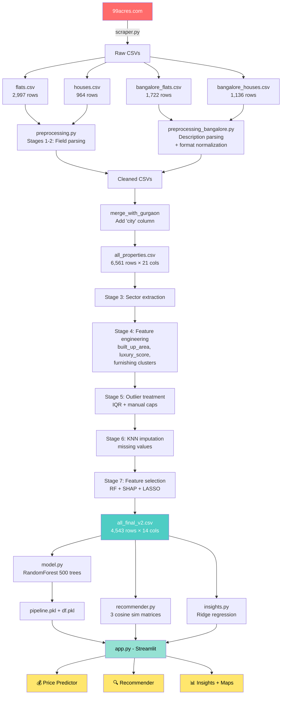
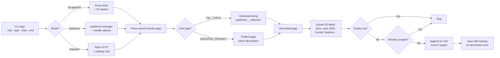
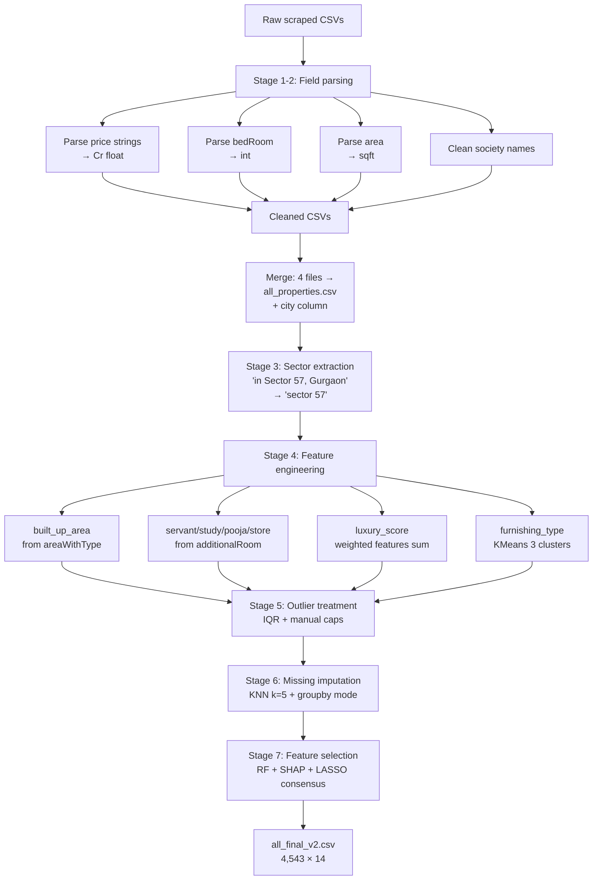
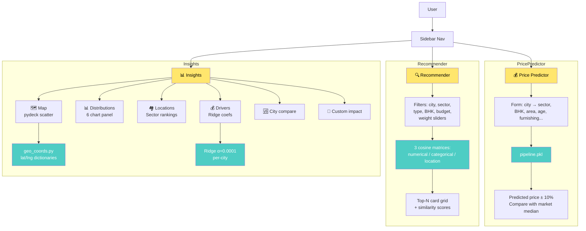

# Pipeline Flowchart

The complete data → model → app pipeline.

## End-to-end flow

```mermaid
flowchart TD
    A[99acres.com] -->|scraper.py| B[Raw CSVs]
    B --> B1[flats.csv<br/>2,997 rows]
    B --> B2[houses.csv<br/>964 rows]
    B --> B3[bangalore_flats.csv<br/>1,722 rows]
    B --> B4[bangalore_houses.csv<br/>1,136 rows]

    B1 --> C[preprocessing.py<br/>Stages 1-2: Field parsing]
    B2 --> C
    B3 --> D[preprocessing_bangalore.py<br/>Description parsing<br/>+ format normalization]
    B4 --> D

    C --> E[Cleaned CSVs]
    D --> E

    E --> F[merge_with_gurgaon<br/>Add 'city' column]
    F --> G[all_properties.csv<br/>6,561 rows × 21 cols]

    G --> H[Stage 3: Sector extraction]
    H --> I[Stage 4: Feature engineering<br/>built_up_area, luxury_score,<br/>furnishing clusters]
    I --> J[Stage 5: Outlier treatment<br/>IQR + manual caps]
    J --> K[Stage 6: KNN imputation<br/>missing values]
    K --> L[Stage 7: Feature selection<br/>RF + SHAP + LASSO]

    L --> M[all_final_v2.csv<br/>4,543 rows × 14 cols]

    M --> N[model.py<br/>RandomForest 500 trees]
    M --> O[recommender.py<br/>3 cosine sim matrices]
    M --> P[insights.py<br/>Ridge regression]

    N --> Q[pipeline.pkl + df.pkl]

    Q --> R[app.py - Streamlit]
    O --> R
    P --> R

    R --> S[💰 Price Predictor]
    R --> T[🔍 Recommender]
    R --> U[📊 Insights + Maps]

    style A fill:#FF6B6B,color:#fff
    style M fill:#4ECDC4,color:#fff
    style R fill:#95E1D3,color:#000
    style S fill:#FFE66D,color:#000
    style T fill:#FFE66D,color:#000
    style U fill:#FFE66D,color:#000
```

## Scraper internals

```mermaid
flowchart LR
    A[CLI args:<br/>--city --type --start --end] --> B{Mode?}
    B -->|ScraperAPI| C[Proxy fetch<br/>+ IP rotation]
    B -->|Selenium| D[webdriver-manager<br/>+ stealth options]
    B -->|requests| E[Plain HTTP<br/>+ rotating UAs]

    C --> F[Parse search-results page]
    D --> F
    E --> F

    F --> G{Card type?}
    G -->|FSL_TUPLE| H[Individual listing<br/>tupleNew__ selectors]
    G -->|GROUPED_PROJECT| I[Project page<br/>parse description]

    H --> J[Visit detail page]
    I --> J

    J --> K[Extract 20 fields:<br/>price, area, BHK,<br/>furnish, features...]

    K --> L{Empty row?}
    L -->|Yes| M[Skip]
    L -->|No| N{Already scraped?}
    N -->|Yes| M
    N -->|No| O[Append to CSV<br/>every 5 pages]

    O --> P[Save with backup<br/>on permission error]
```

## Preprocessing pipeline (7 stages)

```mermaid
flowchart TD
    A[Raw scraped CSVs] --> B[Stage 1-2: Field parsing]
    B --> B1[Parse price strings<br/>→ Cr float]
    B --> B2[Parse bedRoom<br/>→ int]
    B --> B3[Parse area<br/>→ sqft]
    B --> B4[Clean society names]

    B1 --> C[Cleaned CSVs]
    B2 --> C
    B3 --> C
    B4 --> C

    C --> D[Merge: 4 files →<br/>all_properties.csv<br/>+ city column]

    D --> E[Stage 3: Sector extraction<br/>'in Sector 57, Gurgaon'<br/>→ 'sector 57']
    E --> F[Stage 4: Feature engineering]

    F --> F1[built_up_area<br/>from areaWithType]
    F --> F2[servant/study/pooja/store<br/>from additionalRoom]
    F --> F3[luxury_score<br/>weighted features sum]
    F --> F4[furnishing_type<br/>KMeans 3 clusters]

    F1 --> G[Stage 5: Outlier treatment<br/>IQR + manual caps]
    F2 --> G
    F3 --> G
    F4 --> G

    G --> H[Stage 6: Missing imputation<br/>KNN k=5 + groupby mode]
    H --> I[Stage 7: Feature selection<br/>RF + SHAP + LASSO consensus]

    I --> J[all_final_v2.csv<br/>4,543 × 14]
```

## App architecture

```mermaid
flowchart TD
    User --> Sidebar[Sidebar Nav]
    Sidebar --> P1[💰 Price Predictor]
    Sidebar --> P2[🔍 Recommender]
    Sidebar --> P3[📊 Insights]

    subgraph PricePredictor
        P1 --> F1[Form: city → sector,<br/>BHK, area, age, furnishing...]
        F1 --> M1[pipeline.pkl]
        M1 --> O1[Predicted price ± 10%<br/>Compare with market median]
    end

    subgraph Recommender
        P2 --> F2[Filters: city, sector,<br/>type, BHK, budget,<br/>weight sliders]
        F2 --> R1[3 cosine matrices:<br/>numerical / categorical / location]
        R1 --> O2[Top-N card grid<br/>+ similarity scores]
    end

    subgraph Insights
        P3 --> T1[🗺 Map<br/>pydeck scatter]
        P3 --> T2[📊 Distributions<br/>6 chart panel]
        P3 --> T3[🏘 Locations<br/>Sector rankings]
        P3 --> T4[💰 Drivers<br/>Ridge coefs]
        P3 --> T5[🆚 City compare]
        P3 --> T6[🔬 Custom impact]

        T1 --> G1[geo_coords.py<br/>lat/lng dictionaries]
        T4 --> R2[Ridge α=0.0001<br/>per-city]
    end

    classDef artifact fill:#4ECDC4,color:#fff
    classDef ui fill:#FFE66D,color:#000
    class M1,R1,R2,G1 artifact
    class P1,P2,P3 ui
```
