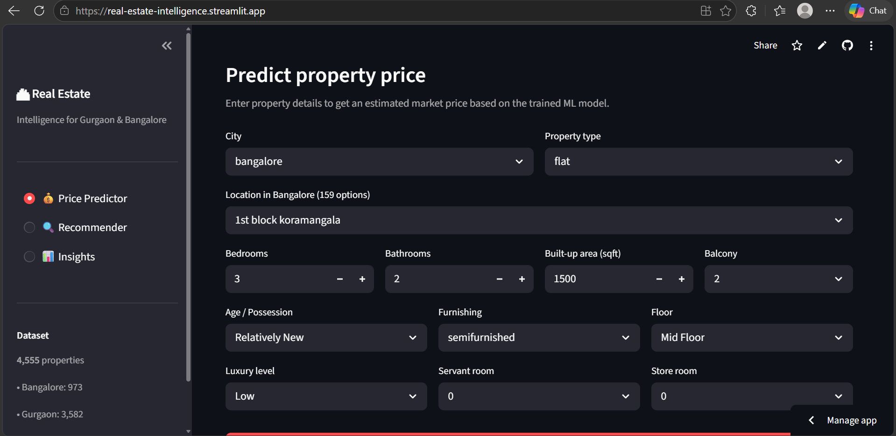
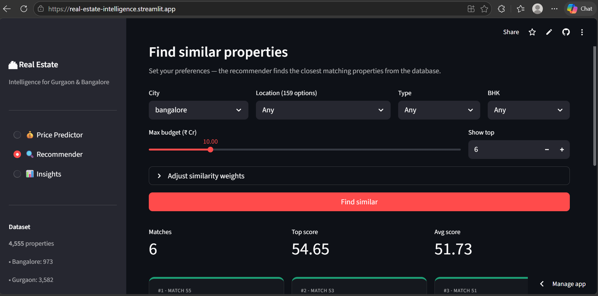
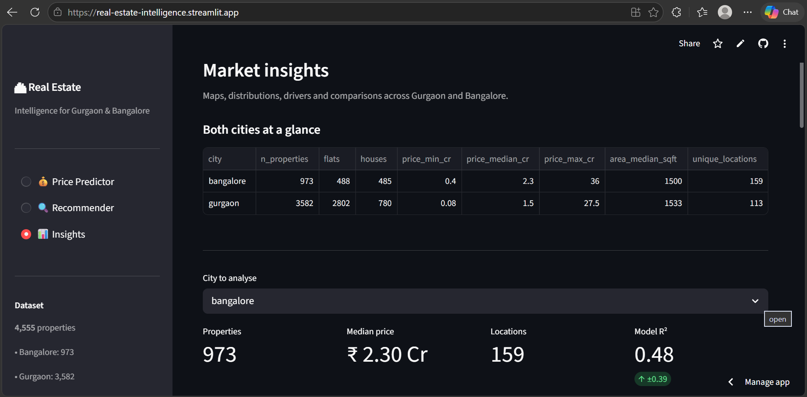
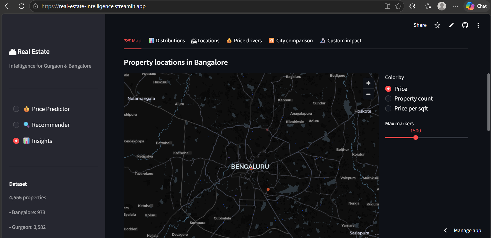
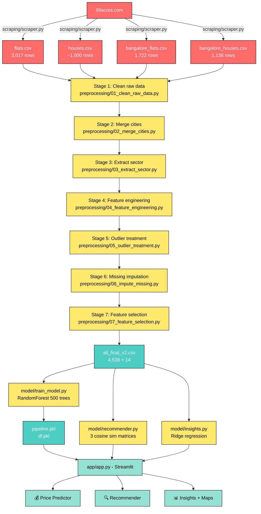

# 🏙 Real Estate Intelligence App

End-to-end machine learning project for **property price prediction**, **similarity search**, and **market insights** across **Gurgaon** and **Bangalore**, using data scraped from 99acres.com.

```
4,538 properties  ·  272 unique locations  ·  R² = 0.85  ·  3 cities of analysis
```

---

## 🚀 Live Demo

The app is **deployed and live** on two platforms:

| Platform | URL                                            | Status |
|----------|------------------------------------------------|:------:|
| **Streamlit Community Cloud** | https://real-estate-intelligence.streamlit.app | ✅ Live |
| **AWS EC2** | http://YOUR_EC2_PUBLIC_IP:8501                 | ✅ Live |

### Screenshots

#### 💰 Price Predictor
Predict any property's market price by selecting city, location, and property attributes.



#### 🔍 Recommender
Find similar properties by city, location, type, BHK and budget. Adjust the similarity weights in the expander.



#### 📊 Insights — Both cities at a glance
Side-by-side stats with model R² per city, plus filtering controls.



#### 🗺 Insights — Interactive map
Each dot is a sector, sized and colored by price / property count / ₹ per sqft (toggleable).



---

## 📑 Table of Contents

1. [Live Demo](#-live-demo)
2. [Overview](#overview)
3. [Pipeline Flowchart](#pipeline-flowchart)
4. [Repo Structure](#repo-structure)
5. [Tech Stack](#tech-stack)
6. [Stage 1 — Data Gathering (Web Scraping)](#stage-1--data-gathering-web-scraping)
7. [Stage 2 — Data Preprocessing (7 sub-stages)](#stage-2--data-preprocessing)
8. [Stage 3 — Model Building](#stage-3--model-building)
9. [Stage 4 — Recommender System](#stage-4--recommender-system)
10. [Stage 5 — Insights Module](#stage-5--insights-module)
11. [Stage 6 — Streamlit App](#stage-6--streamlit-app)
12. [Setup & Run](#setup--run)
13. [Deployment](#deployment)
14. [Results](#results)

---

## Overview

| | Gurgaon | Bangalore | Total |
|---|---:|---:|---:|
| Properties (final) | 3,583 | 955 | **4,538** |
| Locations | 113 | 160 | **273** |
| Price range (₹ Cr) | 0.07 – 31.5 | 0.40 – 36.0 | – |

The project produces a Streamlit web app with three modules:

- **💰 Price Predictor** — Random Forest regression (R² = 0.85)
- **🔍 Recommender** — multi-signal cosine similarity
- **📊 Insights** — Ridge regression + interactive maps

---

## Pipeline Flowchart



---

## Repo Structure

```
real-estate-intelligence/
│
├── README.md                          ← you're here
├── requirements.txt
│
├── data/
│   ├── raw/                           ← scraped CSVs (one per source)
│   │   ├── flats.csv                  Gurgaon flats
│   │   ├── houses.csv                 Gurgaon houses
│   │   ├── bangalore_flats.csv        Bangalore flats
│   │   └── bangalore_houses.csv       Bangalore houses
│   └── processed/
│       └── all_final_v2.csv           model-ready (4,538 × 14)
│
├── scraping/
│   └── scraper.py                     99acres scraper (all 4 types, both cities)
│
├── preprocessing/
│   ├── 01_clean_raw_data.py           Stage 1: clean each raw CSV
│   ├── 02_merge_cities.py             Stage 2: combine + add city column
│   ├── 03_extract_sector.py           Stage 3: extract location
│   ├── 04_feature_engineering.py      Stage 4: built_up_area, luxury, etc.
│   ├── 05_outlier_treatment.py        Stage 5: cap/correct extremes
│   ├── 06_impute_missing.py           Stage 6: fill missing values
│   ├── 07_feature_selection.py        Stage 7: final 14 columns
│   └── run_all.py                     run all 7 stages sequentially
│
├── model/
│   ├── train_model.py                 RandomForest training + save pkl
│   ├── recommender.py                 cosine similarity recommender
│   ├── insights.py                    Ridge regression analyser
│   ├── pipeline.pkl                   trained model (regenerable)
│   └── df.pkl                         feature DataFrame (regenerable)
│
└── app/
    ├── app.py                         Streamlit UI (3 pages)
    └── geo_coords.py                  lat/lng for maps
```

---

## Tech Stack

| Layer | Libraries |
|------|-----------|
| **Web scraping** | `requests`, `beautifulsoup4`, `selenium`, `webdriver-manager`, ScraperAPI |
| **Data wrangling** | `pandas`, `numpy`, `regex` |
| **ML modelling** | `scikit-learn` (RandomForest, Ridge, KMeans, KNNImputer, StandardScaler, OneHotEncoder, ColumnTransformer, GridSearchCV), `xgboost`, `statsmodels` |
| **Recommender** | `sklearn.metrics.pairwise.cosine_similarity` |
| **UI** | `streamlit`, `pydeck` (maps), `altair` |

---

## Stage 1 — Data Gathering (Web Scraping)

**File:** [`scraping/scraper.py`](scraping/scraper.py)

Scrapes 4 property types per city from 99acres.com:

| Property type | URL pattern | Output |
|--------------|-------------|--------|
| Apartments / societies | `/property-in-{city}-ffid-page-{n}` | `{city}_appartments.csv` |
| Individual flats | `/flats-in-{city}-ffid-page-{n}` | `{city}_flats.csv` |
| Independent houses | `/independent-house-in-{city}-ffid-page-{n}` | `{city}_houses.csv` |
| Residential land | `/residential-land-in-{city}-ffid-page-{n}` | `{city}_residential_land.csv` |

### How a scrape iteration works

```python
# Simplified code from scraping/scraper.py

def scrape_flats(city, start, end):
    referer = f'https://www.99acres.com/flats-in-{city}-ffid'
    records = []

    for page_num in range(start, end):
        url = f'https://www.99acres.com/flats-in-{city}-ffid-page-{page_num}'

        # 1. Fetch via ScraperAPI (or Selenium / requests fallback)
        resp = _fetch(url, referer)
        if resp.status_code == 410:        # No more pages
            break

        soup       = BeautifulSoup(resp.content, 'html.parser')
        search_div = soup.select_one('div[data-label="SEARCH"]')

        # 2. For each listing card on the page
        for sec in search_div.select('section[data-hydration-on-demand="true"]'):
            # 3. Extract surface fields from the card
            link_el  = sec.select_one('a.tupleNew__propertyHeading')
            link     = link_el['href']
            society  = sec.select_one('div.tupleNew__locationName').text
            psqft    = sec.select_one('div.tupleNew__perSqftWrap').text

            # 4. Visit detail page for full fields
            dresp  = _fetch(link, referer)
            dsoup  = BeautifulSoup(dresp.content, 'html.parser')

            records.append({
                'property_name':  sec.select_one('h2.tupleNew__propType').text,
                'link':           link,
                'society':        society,
                'price':          dsoup.select_one('#pdPrice2').text,
                'area':           psqft,
                'areaWithType':   dsoup.select_one('#factArea').text,
                'bedRoom':        dsoup.select_one('#bedRoomNum').text,
                'bathroom':       dsoup.select_one('#bathroomNum').text,
                'balcony':        dsoup.select_one('#balconyNum').text,
                'address':        dsoup.select_one('#address').text,
                # ... 12 more fields
            })

        # 5. Save every 5 pages so a crash doesn't lose data
        if page_num % 5 == 0:
            _save(records, output)
```

### Anti-blocking strategies built in

| Strategy | Implementation |
|----------|---------------|
| **Rotating User-Agents** | 7 real browser strings, fresh every request |
| **Adaptive delays** | 1.5–3.5s between requests, 10–18s every 4 reqs, 50–90s every 20 reqs |
| **Block detection** | Catches 403, 429, 503, "Access Denied", CAPTCHA, ChromeError |
| **3 fetch backends** | ScraperAPI (primary) → Selenium → plain requests |
| **HTTP 410 detection** | Recognises "no more pages" and stops cleanly |
| **Description parser** | Recovers BHK/price/area from project-page descriptions when individual fields are blank (~75% of Bangalore listings) |
| **Auto-resume** | Skips already-scraped property_ids on restart |
| **Crash safety** | Saves every 5 pages + `try/finally` save on exit |

### Run the scraper

```bash
# Get a free API key at scraperapi.com (1000 req/month free)
python scraping/scraper.py \
    --city bangalore --type flats \
    --start 1 --end 50 \
    --api-key YOUR_KEY \
    --workers 5

# Without ScraperAPI (uses Selenium, slower but free)
python scraping/scraper.py --city bangalore --type all --mode selenium
```

### Sample output: bangalore_flats.csv (truncated)

```csv
property_name,link,society,price,area,areaWithType,bedRoom,bathroom,balcony,...
"3 BHK Flat in Whitefield, Bangalore",https://...,Sumadhura Solace,1.8 Crore,...,Super Built-up area 1450(134.7 sq.m.),3 Bedrooms,3,2,...
"4 BHK Flat in Hebbal, Bangalore",https://...,Prestige Falcon City,5.65 Crore,...,Super Built-up area 2500(232.3 sq.m.),4 Bedrooms,4,3+,...
```

---

## Stage 2 — Data Preprocessing

The preprocessing pipeline is **modular**: each stage is a separate file you can run independently or via `run_all.py`. Each stage takes the previous stage's CSV as input and produces the next stage's CSV as output.

```bash
python preprocessing/run_all.py    # runs all 7 stages
```

### Stage 1 — Initial cleaning

**File:** [`preprocessing/01_clean_raw_data.py`](preprocessing/01_clean_raw_data.py)
**Input:** raw `data/raw/*.csv` (4 files)
**Output:** `data/processed/*_cleaned.csv` (4 files)

Universal field parsers handle every format found across the four sources:

```python
# Handles: "1.7 Crore", "85 Lac", "₹ 0.94 - 1.34 Cr"  → float in Cr
def parse_price_to_cr(s) -> float:
    # range format
    m = re.search(r'([\d.]+)\s*[-–]\s*([\d.]+)\s*(Cr|Crore|Lac|L)', s)
    if m:
        lo, hi, unit = float(m.group(1)), float(m.group(2)), m.group(3)
        midpoint = (lo + hi) / 2
        return midpoint / 100 if unit.startswith('L') else midpoint
    # single value
    m = re.search(r'([\d.]+)\s*(Crore|Cr|Lac|L)', s)
    if m:
        val, unit = float(m.group(1)), m.group(2)
        return val / 100 if unit.startswith('L') else val
```

**Description recovery (key for Bangalore):** ~75% of Bangalore listings are project-pages with empty individual fields. The description has all the data — regex extracts it:

```python
# Description: "Choose your dream home from the wide variety of 2,3,4 BHK
#  apartments in JP Nagar... in range of 1,170-2,085 sqft...
#  price range Rs. 1.23 - 2.19 Cr"
# →  bedRoom=4, price=1.71, areaWithType="1,170-2,085 sqft"
```

Result: rows with `bedRoom`, `price`, and `area` ≥ **97%** populated (was ~33%).

### Stage 2 — Merge cities

**File:** [`preprocessing/02_merge_cities.py`](preprocessing/02_merge_cities.py)

Combines all 4 cleaned files into `all_properties.csv` and adds an explicit `city` column.

```
+ flats_cleaned.csv                  2,863 rows  city=gurgaon
+ house_cleaned.csv                    945 rows  city=gurgaon
+ bangalore_flats_cleaned.csv        1,513 rows  city=bangalore
+ bangalore_house_cleaned.csv        1,087 rows  city=bangalore
```

### Stage 3 — Extract sector

**File:** [`preprocessing/03_extract_sector.py`](preprocessing/03_extract_sector.py)

Pulls the location from `property_name`:
- `"3 BHK Flat in Sector 57, Gurgaon"` → `sector 57`
- `"4 BHK Flat in Whitefield, Bangalore"` → `whitefield, bangalore`

Applies a `SECTOR_MAP` of ~50 known Gurgaon aliases:
- `"dlf phase 1"` → `sector 26`
- `"sushant lok phase 3"` → `sector 57`

Drops sectors with < 3 listings (not statistically representative).

**Bangalore sector names are also simplified** — verbose strings are reduced to the core neighborhood name:
- `whitefield, bangalore` → `whitefield`
- `koramangala, bangalore` → `koramangala`
- `chikkagubbi, hennur road` → `chikkagubbi`
- `bidaraguppe, bangalore south` → `bidaraguppe`
- `balagere, near panathur, bangalore` → `balagere`

### Stage 4 — Feature engineering

**File:** [`preprocessing/04_feature_engineering.py`](preprocessing/04_feature_engineering.py)

Creates 6 new features:

| Feature | How |
|---------|-----|
| `built_up_area` (sqft) | Parsed from `areaWithType`: `"Super Built-up area 1130(104.98 sq.m.)"` → 1130. sqm→sqft conversion when applicable |
| `super_built_up_area`, `carpet_area` | Parsed similarly for the alternate forms |
| `study room`, `servant room`, `store room`, `pooja room`, `others` | Binary 0/1 from `additionalRoom` text |
| `luxury_score` | Weighted sum: Golf Course=10, Spa=9, Gym=8, ATM=4 across 100 amenities |
| `furnishing_type` | KMeans(3) cluster of furnish-detail counts (0=unfurnished, 1=semi, 2=furnished) |
| `agePossession` | Bucketed into 5 categories (New, Relatively New, Moderately Old, Old, Under Construction) |

### Stage 5 — Outlier treatment

**File:** [`preprocessing/05_outlier_treatment.py`](preprocessing/05_outlier_treatment.py)

- IQR-based capping on `price_per_sqft` (with ×9 scale-fix for sqyd typos)
- Drop area > 100,000 sqft (impossible) and 9 known bad rows
- Manual area corrections for 8 specific rows (verified during EDA)
- Cap `bedRoom` ≤ 10
- Recalculate `price_per_sqft` after corrections

### Stage 6 — Missing-value imputation

**File:** [`preprocessing/06_impute_missing.py`](preprocessing/06_impute_missing.py)

Smart `built_up_area` imputation using ratios derived from complete rows:

```
r_super  = median(super_built_up / built_up)   ≈ 1.106
r_carpet = median(carpet         / built_up)   ≈ 0.901

# When built_up is missing:
if super and carpet present:  built_up = (super/r_super + carpet/r_carpet) / 2
elif super present:           built_up = super / r_super
elif carpet present:          built_up = carpet / r_carpet
```

For categorical missing values (`agePossession='Undefined'`), three-pass mode imputation:
1. From `(sector + property_type)` group mode
2. Then from `(sector)` group mode
3. Finally from `(property_type)` group mode

### Stage 7 — Feature selection

**File:** [`preprocessing/07_feature_selection.py`](preprocessing/07_feature_selection.py)

Discretises continuous features and drops low-importance columns (confirmed via consensus of RF importance, SHAP, permutation, LASSO):

- `luxury_category` ← discretised `luxury_score` (Low/Medium/High)
- `floor_category` ← discretised `floorNum` (Low/Mid/High Floor)

**Final 14 columns** (model-ready):
```
city, property_type, sector, price, bedRoom, bathroom, balcony,
agePossession, built_up_area, servant room, store room,
furnishing_type, luxury_category, floor_category
```

---

## Stage 3 — Model Building

**File:** [`model/train_model.py`](model/train_model.py)

### Algorithm comparison (10-fold CV)

| Model | CV R² | MAE (Cr) |
|-------|------:|---------:|
| **Random Forest** ⭐ | **0.854** | 0.39 |
| Extra Trees | 0.851 | 0.41 |
| XGBoost | 0.849 | 0.40 |
| LightGBM | 0.844 | 0.42 |
| Gradient Boosting | 0.834 | 0.43 |
| Ridge | 0.851 | 0.45 |
| Lasso | 0.847 | 0.46 |
| Linear Regression | 0.851 | 0.45 |
| ElasticNet | 0.836 | 0.49 |
| KNN | 0.798 | 0.55 |
| SVR | 0.812 | 0.51 |

Random Forest wins → final choice.

### Pipeline

```python
ColumnTransformer:
  • num: StandardScaler      on  [bedRoom, bathroom, built_up_area,
                                  servant room, store room]
  • cat: OneHotEncoder       on  [city, property_type, sector, balcony,
        (drop_first=True,         agePossession, furnishing_type,
         handle_unknown='ignore') luxury_category, floor_category]
        ↓
RandomForestRegressor(n_estimators=500, random_state=42)
```

The target is **log-transformed** (`np.log1p(price)`) before training and inverse-transformed (`np.expm1`) at predict time. Real-estate prices are heavily right-skewed → log space gives much better MAE.

### Adding `city` as an explicit feature

Adding `city` as its own categorical feature (rather than relying on sector OHE) **boosted CV R² from 0.844 → 0.855**.

### Final performance

| Metric | Value |
|--------|------:|
| 10-fold CV R² | **0.855 ± 0.018** |
| Train R² | 0.982 |
| MAE | ₹0.42 Cr |

### Run

```bash
python model/train_model.py
# → produces model/pipeline.pkl + model/df.pkl
```

---

## Stage 4 — Recommender System

**File:** [`model/recommender.py`](model/recommender.py)

A **multi-signal cosine similarity** engine. Three independent similarity matrices computed once at startup, then weighted at query time:

| Signal | Features used | Default weight |
|--------|---------------|---------------:|
| **Numerical** | price, bedRoom, bathroom, built_up_area, servant room, store room | **30** |
| **Categorical** | property_type, agePossession, furnishing_type, luxury_category, floor_category, balcony | **20** |
| **Location** | sector, city | **8** |

Combined similarity score:

```python
final_sim = w_num × cosine_sim(num_features) +
            w_cat × cosine_sim(cat_features) +
            w_loc × cosine_sim(loc_features)
```

Each `cosine_sim()` is `cosine_similarity(StandardScaler.fit_transform(features))`.

### `recommend_by_filters()` flow

```python
def recommend_by_filters(city, sector, property_type, bedrooms, budget_max, top_n=5):
    # 1. Apply filters to find matching candidates
    candidates = df[df.city == city &
                    df.bedRoom == bedrooms &
                    df.price <= budget_max]

    # 2. Use the median-priced match as the "anchor" property
    ref_idx = candidates.iloc[
        (candidates.price - candidates.price.median()).abs().argsort()
    ].index[0]

    # 3. Return top-N nearest neighbors of the anchor
    scores = combined_sim[ref_idx]
    top    = np.argsort(scores)[::-1][1:top_n+1]   # skip self
    return df.iloc[top]
```

### Sample query

```python
from recommender import PropertyRecommender
rec = PropertyRecommender('data/processed/all_final_v2.csv')

results = rec.recommend_by_filters(
    city          = 'bangalore',
    sector        = 'whitefield',
    property_type = 'flat',
    bedrooms      = 3,
    budget_max    = 3.0,    # ₹ 3 Cr max
    top_n         = 5,
)
```

Returns the 5 most similar properties as a DataFrame with a `SimilarityScore` column.

---

## Stage 5 — Insights Module

**File:** [`model/insights.py`](model/insights.py)

Per-city **Ridge regression** for **interpretable feature impacts** — a direct port of the `insights-module.ipynb` analysis.

### Methodology

```python
# 1. Drop low-impact: store room, floor_category, balcony

# 2. Normalise agePossession into 3 buckets
df['agePossession'] = df['agePossession'].replace({
    'Relatively New': 'new', 'New Property': 'new',
    'Moderately Old': 'old', 'Old Property': 'old',
    'Under Construction': 'under construction',
})

# 3. Ordinal encoding
df['property_type']   = {'flat': 0, 'house': 1}
df['luxury_category'] = {'Low': 0, 'Medium': 1, 'High': 2}

# 4. OHE sector + agePossession
new_df = pd.get_dummies(df, columns=['sector', 'agePossession'], drop_first=True)

# 5. Log-transform target
y_log = np.log1p(price)

# 6. Standardise + fit
X_scaled = StandardScaler().fit_transform(X)
ridge    = Ridge(alpha=0.0001).fit(X_scaled, y_log)
```

### Practical interpretation

Each Ridge coefficient = **log-price change per 1 standard deviation of the feature**. To translate to plain English ("if I add 100 sqft, how much does price change?"):

```python
delta_std    = delta_raw / scaler.scale_[col]
log_change   = coef × delta_std
pct_change   = (np.expm1(log_change) - 1) × 100
```

### Sample query

```python
from insights import InsightsAnalyzer
ins = InsightsAnalyzer('data/processed/all_final_v2.csv')

ins.cv_score('gurgaon')
# → {'r2_mean': 0.851, 'r2_std': 0.017, ...}

ins.feature_importance('gurgaon', top_n=5)
# →   feature           coefficient  direction
#     built_up_area       0.2106         +
#     property_type       0.1202         +
#     bathroom            0.0651         +
#     bedRoom             0.0540         +
#     servant room        0.0509         +

ins.predict_impact('gurgaon', 'built_up_area', delta=100)
# → {'price_pct': +0.15%, 'coefficient': 0.2106, ...}
```

### Verified outputs (Gurgaon-only)

| Metric | Notebook | Implementation |
|--------|---------:|---------------:|
| 10-fold CV R² | 0.8513 ± 0.0170 | 0.8513 ± 0.0170 ✓ |
| OLS R² | 0.865 | 0.8649 ✓ |
| `built_up_area` coef | 0.2106 | 0.2106 ✓ |

---

## Stage 6 — Streamlit App

**File:** [`app/app.py`](app/app.py)

Three-page Streamlit app with sidebar navigation.

### 💰 Page 1 — Price Predictor

- Pick city → Location dropdown filtered to that city's sectors
- Form for BHK, area, balcony, age, furnishing, floor, luxury level, etc.
- Predicts price, ±10% confidence band, implied ₹/sqft
- Compares against similar listings (median, min, max)

### 🔍 Page 2 — Recommender

- Filters: city, location, type, BHK, budget
- Adjustable similarity weights (numerical / categorical / location)
- Results displayed as **3-column card grid**, color-coded by match strength

### 📊 Page 3 — Insights (6 sub-tabs)

| Tab | Shows |
|-----|-------|
| 🗺 **Map** | Interactive `pydeck` map with all 272 sectors. Toggle: color by price / count / ₹ per sqft |
| 📊 **Distributions** | 6 charts: price histogram, area histogram, BHK split, type split, furnishing, luxury, scatter (price vs area) |
| 🏘 **Locations** | Sector ranking by 4 metrics, configurable top-N, cheapest 5 vs priciest 5 |
| 💰 **Price drivers** | Ridge coefficients chart with readable labels |
| 🆚 **City comparison** | Side-by-side Gurgaon vs Bangalore: stats table, price by BHK/type/luxury/age, affordability heatmap |
| 🔬 **Custom impact** | "What if I add 100 sqft?" calculator |

### Run the app

```bash
streamlit run app/app.py
```

---

## Setup & Run

### 1. Clone the repo

```bash
git clone https://github.com/YOUR_USERNAME/real-estate-intelligence.git
cd real-estate-intelligence
```

### 2. Install dependencies

```bash
pip install -r requirements.txt
```

### 3. Either use the provided dataset OR rebuild from raw

#### Option A — Use provided dataset (faster)

```bash
# data/processed/all_final_v2.csv is already in the repo
python model/train_model.py        # builds pipeline.pkl + df.pkl
streamlit run app/app.py
```

#### Option B — Rebuild from raw scraped data

```bash
# Optional: scrape fresh data (skip if you already have data/raw/*.csv)
python scraping/scraper.py --city gurgaon   --type all --start 1 --end 50 --api-key YOUR_KEY
python scraping/scraper.py --city bangalore --type all --start 1 --end 50 --api-key YOUR_KEY

# Run the full preprocessing pipeline
python preprocessing/run_all.py

# Train the model
python model/train_model.py

# Launch the app
streamlit run app/app.py
```

---

## Deployment

The app is deployed on **Streamlit Community Cloud** (primary) and on **AWS EC2** (backup / portfolio demo). Both deployments serve from the same GitHub repo, so a `git push` updates everywhere.

### 🌐 Streamlit Community Cloud

**Live URL:** https://real-estate-intelligence.streamlit.app

Streamlit Cloud is the simplest hosting option — free tier, GitHub-backed, deploys in ~5 minutes.

**Deployment steps:**

1. Push the repo to GitHub (public repo required for free tier)
2. Go to https://share.streamlit.io/
3. Sign in with GitHub
4. Click **"New app"** and fill in:
   - **Repository:** `YOUR_USERNAME/real-estate-intelligence`
   - **Branch:** `main`
   - **Main file path:** `app/app.py`
5. Click **Deploy**

The build provisions a container, installs `requirements.txt`, and starts the app. First load takes ~5–8 minutes; subsequent loads are instant. The app sleeps after 7 days of inactivity and auto-wakes (~30 seconds) when someone visits.

**Files used by the cloud build:**

| File | Purpose |
|------|---------|
| `requirements.txt` | Python dependencies |
| `runtime.txt` | Pins Python 3.11 |
| `.streamlit/config.toml` | Theme + server settings |
| `app/app.py` | Main entry point |

### ☁️ AWS EC2

**Live URL:** http://YOUR_EC2_PUBLIC_IP:8501

AWS EC2 gives full server control and runs 24/7 without sleeping (small monthly cost). Useful for production traffic or when Streamlit Cloud's free tier limits become a constraint.

**Deployment steps:**

#### 1. Set up an EC2 instance

In the AWS Management Console, launch an Ubuntu instance (e.g. `t2.micro` for free-tier testing or `t3.small` for production). Configure the security group to allow:

- Inbound port `8501` (Streamlit's default)
- Inbound port `22` (SSH)

#### 2. Connect over SSH

```bash
ssh -i "path_to_your_key.pem" ubuntu@YOUR-EC2-PUBLIC-IP
```

#### 3. Prepare the instance

```bash
sudo apt update && sudo apt upgrade -y
sudo apt install python3 python3-pip git -y
```

#### 4. Clone the repo

```bash
git clone https://github.com/YOUR_USERNAME/real-estate-intelligence.git
cd real-estate-intelligence
```

(Or use **WinSCP** to transfer files from your local machine if you prefer a GUI.)

#### 5. Install dependencies

```bash
pip3 install -r requirements.txt
```

#### 6. Make sure Streamlit is on PATH

```bash
export PATH=$PATH:/home/ubuntu/.local/bin
```

Add it to `~/.bashrc` to make it permanent.

#### 7. Run the app

```bash
streamlit run app/app.py
```

The app is now reachable at `http://YOUR-EC2-PUBLIC-IP:8501`.

#### 8. Keep it running in the background

If you close the SSH session the app stops. To detach it:

```bash
nohup streamlit run app/app.py > streamlit.log 2>&1 &
```

This runs the app in the background and logs to `streamlit.log`. To stop it later, find the process with `ps aux | grep streamlit` and `kill <PID>`.

#### Optional: production hardening

For a more robust setup, run Streamlit behind **nginx** as a reverse proxy on port 80/443, with **systemd** managing the streamlit process so it auto-restarts on crash or reboot.

```ini
# /etc/systemd/system/streamlit.service
[Unit]
Description=Streamlit App
After=network.target

[Service]
Type=simple
User=ubuntu
WorkingDirectory=/home/ubuntu/real-estate-intelligence
ExecStart=/home/ubuntu/.local/bin/streamlit run app/app.py
Restart=always

[Install]
WantedBy=multi-user.target
```

Then `sudo systemctl enable --now streamlit`.

---

## Results

### Final dataset

```
Total: 4,538 properties
─────────────────────────────────
Gurgaon flats:    2,800
Gurgaon houses:     783
Bangalore flats:    485
Bangalore houses:   470
─────────────────────────────────
Unique sectors:    273 (113 + 160)
```

### Model performance

| Metric | Value |
|--------|------:|
| 10-fold CV R² | **0.855 ± 0.018** |
| Train R² | 0.982 |
| MAE | ₹0.42 Cr |

### Sample predictions

| Input | Predicted price |
|-------|----------------:|
| 3 BHK flat, 1500 sqft, **Sector 57 (Gurgaon)**, Mid floor | **₹1.21 Cr** |
| 3 BHK flat, 1500 sqft, **Whitefield (Bangalore)**, Mid floor | **₹1.96 Cr** |
| 4 BHK house, 2750 sqft, **Sector 102 (Gurgaon)**, Low floor | ₹4.05 Cr |
| 4 BHK house, 2500 sqft, **Hebbal (Bangalore)**, Low floor | ₹5.65 Cr |

The model correctly captures that Bangalore prices/sqft run higher than Gurgaon for the same configuration.

---

## License

MIT

## Acknowledgments

- Data source: [99acres.com](https://www.99acres.com/)
- Coordinates: OpenStreetMap public data
