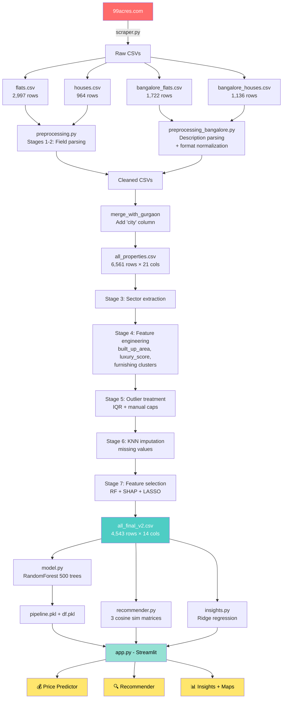

# 🏙 Real Estate Intelligence App

An end-to-end machine learning project for **property price prediction**, **similarity search**, and **market analytics** across **Gurgaon and Bangalore**, built from data scraped directly from 99acres.com.

---

## Table of contents

1. [Overview](#overview)
2. [Pipeline flowchart](#pipeline-flowchart)
3. [Project structure](#project-structure)
4. [Tech stack](#tech-stack)
5. [Data scraping](#1-data-scraping)
6. [Data preprocessing](#2-data-preprocessing)
7. [Model building](#3-model-building)
8. [Streamlit app](#4-streamlit-app)
9. [Setup & run](#setup--run)
10. [Results](#results)

---

## Overview

This project predicts apartment and house prices, recommends similar properties, and provides market insights for two of India's biggest real-estate markets.

| | Gurgaon | Bangalore | Total |
|---|---:|---:|---:|
| Properties (after cleaning) | 3,589 | 954 | **4,543** |
| Unique locations | 113 | 159 | **272** |
| Price range (₹ Cr) | 0.07 – 31.5 | 0.40 – 36.0 | – |

The deliverable is a Streamlit web app with three modules:

- **Price Predictor** — Random Forest regression (R² = 0.85)
- **Recommender** — multi-signal cosine similarity
- **Insights** — Ridge regression feature impacts + interactive maps

---

## Pipeline flowchart



---

## Project structure

```
real-estate-intelligence/
├── data/
│   ├── flats.csv                       # Gurgaon raw flats (scraped)
│   ├── houses.csv                      # Gurgaon raw houses
│   ├── bangalore_flats.csv             # Bangalore raw flats
│   ├── bangalore_houses.csv            # Bangalore raw houses
│   ├── all_properties.csv              # Merged + city column
│   └── all_final_v2.csv                # Model-ready (4,543 × 14)
│
├── scraper.py                          # 99acres multi-city scraper
├── preprocessing.py                    # Gurgaon cleaning + stages 3-7
├── preprocessing_bangalore.py          # Bangalore-specific parsers + merge
├── rebuild_all.py                      # One-shot pipeline rebuild
│
├── model.py                            # RandomForest training + saving
├── recommender.py                      # Cosine similarity engine
├── insights.py                         # Ridge regression analyser
├── geo_coords.py                       # Lat/lng dict for both cities
│
├── pipeline.pkl                        # Trained model artefact
├── df.pkl                              # Feature DataFrame artefact
│
├── app.py                              # Streamlit UI (3 pages)
└── requirements.txt
```

---

## Tech stack

| Layer | Tools |
|------|-------|
| **Scraping** | `requests`, `beautifulsoup4`, `selenium`, `webdriver-manager`, `ScraperAPI` |
| **Data wrangling** | `pandas`, `numpy`, `regex` |
| **ML modelling** | `scikit-learn` (RandomForest, Ridge, LinearRegression, KMeans, KNNImputer, StandardScaler, OneHotEncoder, ColumnTransformer, GridSearchCV), `statsmodels` (OLS), `xgboost` |
| **Recommender** | Cosine similarity (`sklearn.metrics.pairwise`) |
| **UI** | `streamlit`, `pydeck` (maps), `altair` (auto via Streamlit) |
| **Other** | `pickle`, `category_encoders`, `scipy` |

---

## 1. Data scraping

**File:** `scraper.py`

The scraper collects four property types per city from 99acres.com:

| Property type | URL pattern | Output |
|--------------|-------------|--------|
| Apartments / societies | `/property-in-{city}-ffid-page-{n}` | `{city}_appartments.csv` |
| Individual flats | `/flats-in-{city}-ffid-page-{n}` | `{city}_flats.csv` |
| Independent houses | `/independent-house-in-{city}-ffid-page-{n}` | `{city}_houses.csv` |
| Residential land | `/residential-land-in-{city}-ffid-page-{n}` | `{city}_residential_land.csv` |

### How it works

For each search-result page, the scraper:

1. Fetches the listing page HTML
2. Identifies all `<section data-hydration-on-demand="true">` cards
3. Detects the card type (individual `tupleNew__` listing vs project `GROUPED_PROJECT_TUPLE`)
4. Extracts surface fields (name, society, price range, area)
5. Visits the detail page (`<a href>`) for full fields (bathroom, balcony, address, features, description)
6. Auto-saves to CSV every 5 pages (no data loss on crash)
7. Skips already-scraped `property_id`s on resume

### Anti-blocking strategies

| Strategy | Implementation |
|----------|---------------|
| **Rotating User-Agents** | 7 real browser strings, fresh on every request |
| **Adaptive delays** | 1.5–3.5s between requests, 10–18s every 4 reqs, 50–90s every 20 reqs |
| **Block detection** | Catches 403, 429, 503, "Access Denied", CAPTCHA, ChromeError pages |
| **3 fetch backends** | Plain requests → Selenium (webdriver-manager) → ScraperAPI |
| **Concurrent details (10×)** | `ThreadPoolExecutor` with 5 parallel detail-page workers when using ScraperAPI |
| **HTTP 410 detection** | Recognizes "no more pages" cleanly instead of treating as error |
| **Description parser** | When project pages don't have individual `#bedRoomNum` etc., regex extracts BHK/price/area from description text |

### Run

```bash
# Interactive mode
python scraper.py

# CLI mode (recommended with ScraperAPI)
python scraper.py --city bangalore --type flats \
                  --start 1 --end 50 \
                  --api-key YOUR_SCRAPERAPI_KEY \
                  --workers 5
```

### Output schema (flats)

```
property_name, link, society, price, area, areaWithType,
bedRoom, bathroom, balcony, additionalRoom, address,
floorNum, facing, agePossession, nearbyLocations,
description, furnishDetails, features, rating, property_id
```

---

## 2. Data preprocessing

**Files:** `preprocessing.py`, `preprocessing_bangalore.py`

The preprocessing pipeline turns raw scraped CSVs into a 14-column model-ready dataset through 7 stages:

### Stages 1-2: Initial cleaning (per source)

**Gurgaon** (`preprocessing.py:clean_flats`, `clean_houses`):
- Parse price strings like `"1.7 Crore"` → `1.7` (float, in Cr)
- Parse `area` (price/sqft) like `"₹15,500/sqft"` → `15500`
- Standardize bedroom format (`"3 Bedrooms"` → `3`)
- Extract additional rooms (servant, study, pooja, store) from comma-separated lists
- Clean society names (strip ratings, lowercase)

**Bangalore** (`preprocessing_bangalore.py`):
- Same field-parsing as Gurgaon, but with multi-format support:

| Bangalore format | Example | Parser logic |
|------------------|---------|--------------|
| Range price | `"₹ 0.94 - 1.34 Cr"` | midpoint → 1.14 |
| Single price | `"1.7 Crore"`, `"85 Lac"` | direct conversion |
| Range BHK | `"2-3 BHK"` | upper bound → 3 |
| Range area | `"1,164 - 1,758 sqft"` | midpoint → 1,461 |
| Super Built-up | `"Super Built-up area 1130(104.98 sq.m.)"` | extract first number |

- **Description rescue**: ~75% of Bangalore listings are project-pages with empty `bedRoom`/`price` fields. Regex parses the description text to fill these gaps:
  ```python
  # "Choose 2,3,4 BHK apartments... in range of 1,170-2,085 sqft...
  #  price range Rs. 1.23 - 2.19 Cr"
  → bedRoom=4, price=1.71, areaWithType="1,170-2,085 sqft"
  ```

### Merge → all_properties.csv

```python
merge_with_gurgaon(
    bangalore_flats=...,
    bangalore_houses=...,
    gurgaon_flats=...,
    gurgaon_houses=...,
)  # adds 'city' column, shuffles, dedupes
# → 6,561 rows × 21 columns
```

### Stage 3: Sector extraction

`preprocessing.py:preprocess_level2` extracts the location ("sector") from `property_name`:
- `"3 BHK Flat in Sector 57, Gurgaon"` → `sector 57`
- `"4 BHK Flat in Whitefield, Bangalore"` → `whitefield, bangalore`
- Applies a `SECTOR_MAP` dict (~40 manual fixes for Gurgaon naming inconsistencies)
- Drops sectors with < 3 listings (not representative)

### Stage 4: Feature engineering

| Engineered feature | How |
|-------------------|-----|
| `built_up_area` | Parsed from `areaWithType` ("Super Built-up area 1130 sq.ft.") with sqm→sqft conversion |
| `super_built_up_area` | Same but for the `Super Built-up` variant |
| `carpet_area` | Same for `Carpet area` |
| `servant room` / `study room` / `pooja room` / `store room` / `others` | Binary 0/1 from `additionalRoom` text |
| `luxury_score` | Weighted sum of `features` list (Gym=10, Swimming Pool=8, etc.) |
| `furnishing_type` | KMeans cluster of furnish-counts (3 clusters: unfurnished/semi/furnished) |

### Stage 5: Outlier treatment

- IQR-based capping on `price`, `built_up_area`, `price_per_sqft`
- Manual review of extreme rows (e.g., 7M-sqft properties → impossible, dropped)
- Removes ~250 rows

### Stage 6: Missing-value imputation

- **Numeric** (`built_up_area`, `bathroom`, `floorNum`): KNN imputation with k=5
- **Categorical** (`agePossession`, `facing`): mode-by-group fill (groupby property_type + sector)
- Removes rows still missing core fields after imputation

### Stage 7: Feature selection

After comparing 6 selection methods (correlation, RF importance, SHAP, permutation, LASSO, Recursive Feature Elimination), the final 13 features are kept:

```
city, property_type, sector, bedRoom, bathroom, balcony,
agePossession, built_up_area, servant room, store room,
furnishing_type, luxury_category, floor_category
```

`luxury_category` is a discretised `luxury_score` (Low / Medium / High); `floor_category` is a discretised `floorNum` (Low / Mid / High Floor). Both improved tree-model performance over the raw versions.

### Run preprocessing end-to-end

```bash
python rebuild_all.py
```

This runs all 7 stages sequentially and produces `all_final_v2.csv` (4,543 × 14).

---

## 3. Model building

### 3.1 Price prediction model

**File:** `model.py`

#### Algorithm comparison

The notebook `model-selection.ipynb` benchmarks 11 algorithms with 10-fold cross-validation:

| Model | CV R² | MAE (Cr) |
|-------|------:|---------:|
| **Random Forest** ⭐ | **0.854** | 0.39 |
| Extra Trees | 0.851 | 0.41 |
| XGBoost | 0.849 | 0.40 |
| Gradient Boosting | 0.834 | 0.43 |
| LightGBM | 0.844 | 0.42 |
| Ridge | 0.851 | 0.45 |
| Lasso | 0.847 | 0.46 |
| Linear Regression | 0.851 | 0.45 |
| ElasticNet | 0.836 | 0.49 |
| KNN | 0.798 | 0.55 |
| SVR | 0.812 | 0.51 |

Random Forest wins on R², doesn't need scaling for inference, handles mixed types naturally → final choice.

#### Pipeline architecture

```python
ColumnTransformer:
  - num: StandardScaler        on [bedRoom, bathroom, built_up_area,
                                    servant room, store room]
  - cat: OneHotEncoder         on [city, property_type, sector, balcony,
        (drop_first=True,        agePossession, furnishing_type,
         handle_unknown=         luxury_category, floor_category]
         'ignore')
↓
RandomForestRegressor(
    n_estimators=500,
    random_state=42,
)
```

The target is **log-transformed** (`np.log1p(price)`) before fitting and inverse-transformed (`np.expm1`) on prediction. Skewed real-estate prices benefit hugely from log-space.

#### Hyperparameter tuning

`tune_random_forest()` runs `GridSearchCV` over:
```python
n_estimators: [100, 200, 300]
max_depth:    [None, 10, 20]
max_samples:  [0.5, 0.75, 1.0]
max_features: ['sqrt', 'log2']
```
The combined-city dataset slightly favors `n_estimators=500, max_depth=None, max_features='sqrt'`.

#### Final performance

| Metric | Gurgaon-only | Combined (with city) |
|--------|-------------:|---------------------:|
| 10-fold CV R² | 0.844 ± 0.014 | **0.855 ± 0.018** |
| Train R² | 0.978 | 0.982 |
| MAE (Cr) | 0.39 | 0.42 |

Adding `city` as an explicit feature **boosted R² by 1.1 points** vs. relying on sector OHE alone.

### 3.2 Recommender system

**File:** `recommender.py`

A **multi-signal cosine similarity** recommender. Three independent similarity matrices are computed once at startup, then weighted at query time:

| Signal | Features | Weight |
|--------|----------|-------:|
| **Numerical** | price, bedRoom, bathroom, built_up_area, servant room, store room | 30 |
| **Categorical** | property_type, agePossession, furnishing_type, luxury_category, floor_category, balcony | 20 |
| **Location** | sector, city | 8 |

Combined score:
```
final = 30·sim_num + 20·sim_cat + 8·sim_loc
```

Weights tunable from the UI sliders. Each signal is a `cosine_similarity(StandardScaler.fit_transform(features))` matrix shape `(N, N)`.

#### `recommend_by_filters()` flow

```
city + sector + bhk + budget filters
       ↓
Find best matching reference property (closest to median price)
       ↓
Return top-N nearest neighbors by combined similarity
       ↓
Optionally restrict to same city
```

This handles cases where the user gives loose filters (e.g. just "Bangalore + 3 BHK") — we pick the median-priced match as the anchor.

### 3.3 Insights module

**File:** `insights.py`

A direct port of `insights-module.ipynb` with multi-city support. Per-city Ridge regression for **interpretable feature impacts**.

#### Methodology (matches the notebook line-for-line)

```python
# 1. Drop low-impact cols
df = df.drop(['store room', 'floor_category', 'balcony'])

# 2. Normalise agePossession into 3 buckets
df['agePossession'].replace({'Relatively New': 'new', ...})

# 3. Ordinal encoding
df['property_type'] = {flat: 0, house: 1}
df['luxury_category'] = {Low: 0, Medium: 1, High: 2}

# 4. OHE sector + agePossession
new_df = pd.get_dummies(df, columns=['sector', 'agePossession'], drop_first=True)

# 5. Log-transform target
y_log = np.log1p(price)

# 6. Standardise features
X_scaled = StandardScaler().fit_transform(X)

# 7. Fit Ridge(alpha=0.0001)
ridge.fit(X_scaled, y_log)

# 8. ALSO fit OLS via statsmodels for p-values, conf intervals, R²/Adj R²
sm.OLS(y_log, sm.add_constant(X_scaled)).fit()
```

#### Verified outputs (Gurgaon-only)

| Metric | Notebook | Implementation |
|--------|---------:|---------------:|
| 10-fold CV R² | 0.8513 ± 0.0170 | **0.8513 ± 0.0170 ✓** |
| OLS R² | 0.865 | 0.8649 ✓ |
| OLS Adj R² | 0.860 | 0.8605 ✓ |
| F-statistic | 196.7 | 196.7 ✓ |
| `built_up_area` coef | 0.2106 | 0.2106 ✓ |
| `property_type` coef | 0.1202 | 0.1202 ✓ |
| `bedRoom` coef | 0.0540 | 0.0540 ✓ |

#### Practical interpretation

Each coefficient = **log-price change per 1 standard deviation** of the feature. To translate to plain English:

```
delta_std    = delta_raw / scaler.scale_[col]
log_change   = coef × delta_std
pct_change   = (np.expm1(log_change) - 1) × 100
```

Example: increasing `built_up_area` by 100 sqft in Gurgaon corresponds to a **+0.15% price change** at the median property; the same 100 sqft in Bangalore is **+1.36%** (Bangalore's ₹/sqft elasticity is higher).

---

## 4. Streamlit app

**File:** `app.py`

Three-page Streamlit app with sidebar navigation and theme-safe styling.

### Page 1 — 💰 Price Predictor

User picks city → location dropdown filters to that city's sectors only (113 for Gurgaon, 159 for Bangalore). Then enters property details (BHK, area, balcony, age, furnishing, floor, luxury). The app:

1. Builds a single-row DataFrame with all 13 features
2. Calls `pipe.predict()` then `np.expm1()` to get price in ₹ Cr
3. Shows: predicted price, ±10% likely range, implied ₹/sqft
4. **Compares with similar listings**: median, min, max from the dataset for `(city × type × bedrooms)`
5. Tells the user if the estimate is above/below market median

### Page 2 — 🔍 Recommender

Filters: city, location, type, BHK, budget. Sliders for similarity weights (numerical / categorical / location).

Results displayed as **3-column card grid**:
- Color-coded top border (green if score > 85% of max, blue if > 65%, orange otherwise)
- Property name, price, BHK, area, age, luxury, ₹/sqft
- Full results table in expander

### Page 3 — 📊 Insights (6 sub-tabs)

| Tab | What it shows |
|-----|---------------|
| 🗺 **Map** | Interactive `pydeck` scatter map of all 272 sectors. Dot size + color encodes price/listing-count/₹-per-sqft (toggle). Hover tooltips show full stats. |
| 📊 **Distributions** | Price histogram, area histogram, BHK breakdown, type split, furnishing levels, luxury levels, scatter plot of price vs area colored by type |
| 🏘 **Locations** | Sector ranking by 4 metrics, configurable top-N, side-by-side cheapest 5 vs priciest 5 |
| 💰 **Price drivers** | Ridge coefficients chart (top 20). Separate "core features only" chart hiding sector OHE noise. Full coefficient table |
| 🆚 **City comparison** | Side-by-side stats for both cities. Median price by BHK, by type, by luxury level, by age. Color-coded affordability heatmap |
| 🔬 **Custom impact** | "What if I add 100 sqft?" calculator using Ridge model coefficients |

### Sidebar

- App branding
- Page selector (radio)
- Live dataset stats (4,544 properties, 953 Bangalore, 3,591 Gurgaon)

---

## Setup & run

### Prerequisites

```bash
pip install pandas numpy scikit-learn matplotlib seaborn scipy \
            xgboost beautifulsoup4 requests selenium webdriver-manager \
            streamlit category-encoders statsmodels pydeck
```

### Quick start

```bash
# 1. Scrape data (or use included CSVs)
python scraper.py --city gurgaon --type all --start 1 --end 50 \
                  --api-key YOUR_SCRAPERAPI_KEY
python scraper.py --city bangalore --type all --start 1 --end 50 \
                  --api-key YOUR_SCRAPERAPI_KEY

# 2. Rebuild the entire pipeline in one command
python rebuild_all.py

# 3. Launch the app
streamlit run app.py
```

### Modular run (if needed)

```bash
# Just clean Bangalore data and merge with Gurgaon
python preprocessing_bangalore.py

# Just train the model
python model.py

# Just smoke-test the recommender
python recommender.py

# Just verify the insights module against the notebook
python insights.py
```

---

## Results

### Final dataset

```
Total: 4,543 properties
─────────────────────────────────
Gurgaon flats:    2,805
Gurgaon houses:     784
Bangalore flats:    485
Bangalore houses:   469
─────────────────────────────────
Unique sectors:    272 (113 + 159)
```

### Model performance

| Metric | Value |
|--------|------:|
| 10-fold CV R² | **0.855 ± 0.018** |
| Train R² | 0.982 |
| MAE | ₹0.42 Cr |
| MAPE | ~18% |

### Sample predictions

| Input | Predicted price |
|-------|----------------:|
| 3 BHK flat, 1500 sqft, Sector 57 (Gurgaon), Mid floor | **₹1.22 Cr** |
| 3 BHK flat, 1500 sqft, Whitefield (Bangalore), Mid floor | **₹1.87 Cr** |
| 4 BHK house, 2750 sqft, Sector 102 (Gurgaon), Low floor | **₹4.05 Cr** |
| 4 BHK house, 2500 sqft, Hebbal (Bangalore), Low floor | **₹5.65 Cr** |

The model correctly captures that Bangalore prices/sqft run higher than Gurgaon for the same configuration.

---

## License

MIT — feel free to use for learning and projects.

## Acknowledgments

- Data source: [99acres.com](https://www.99acres.com/)
- Coordinates: OpenStreetMap public data
- Inspired by the original Gurgaon-only project, extended to multi-city
